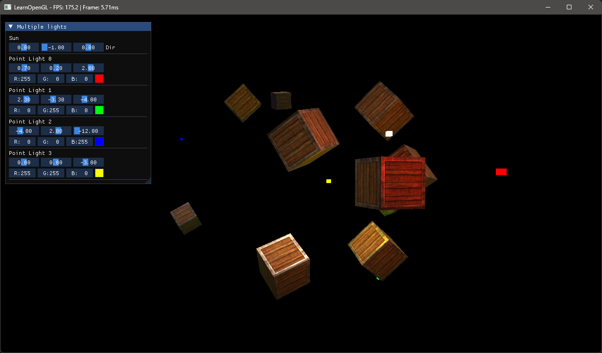

# Minimal Renderer

This is a learning project to get a deeper understanding of the render pipeline in 3D Graphics.

The project follows the [Learn OpenGL](https://learnopengl.com/) online resource, but where it's appropriate, some of the functionality is abstracted into separate classes. This allows for a easier usage as new concepts are taught.

I've also created a 'Scene' system, that lets me build separate demos, for each new concept.

> [!NOTE]
> This is a learning project, the code base is not the most optimal. I'll plan to clean it up as i go.

## Current progress - Multiple lights:

## 3rd Party libraries used:

- ImGui
- GLFW
- GLM
- glad
- stb_image
